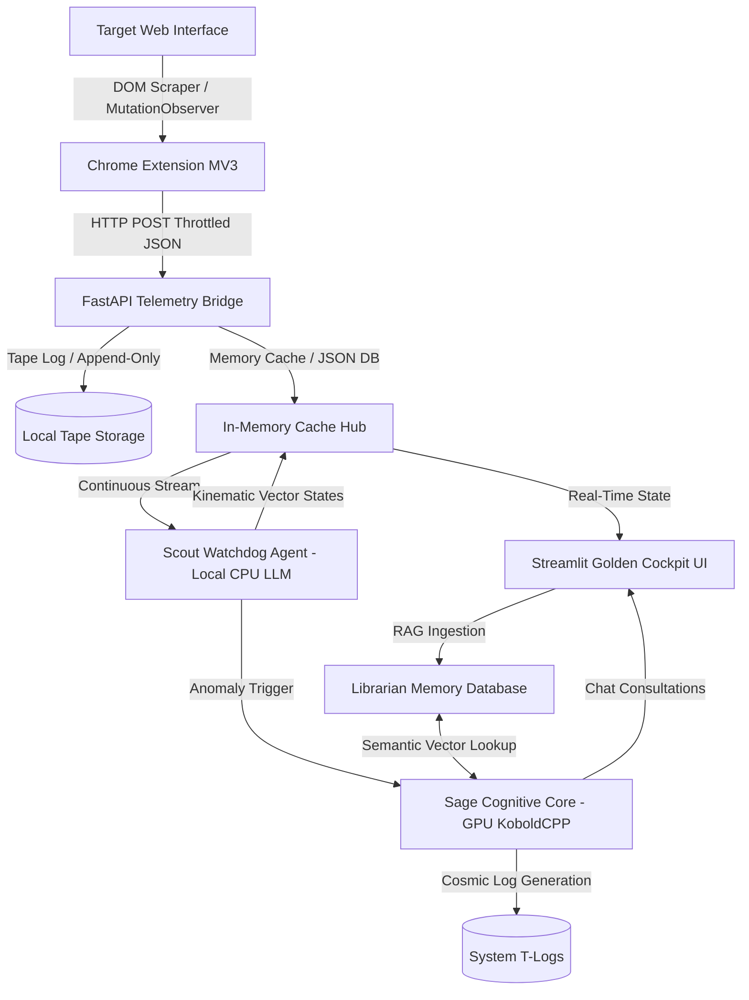

<script type="application/ld+json">
{
  "@context": "https://schema.org",
  "@type": "TechArticle",
  "headline": "[SYSTEM_ARCH] Log 008: Poniżej Warstwy Abstrakcji. Dokumentacja Techniczna Silnika Poznawczego AgentH",
  "author": {
    "@type": "Person",
    "name": "Marcin Marek Lewandowski",
    "url": "https://www.linkedin.com/in/marcinmareklewandowski"
  },
  "publisher": {
    "@type": "Organization",
    "name": "Heniu.blog"
  },
  "datePublished": "2026-05-21T20:00:00+02:00",
  "about": "Algorithmic Trading, Order Flow Cosmology, Market Microstructure",
  "keywords": "Dual-LLM, Air-gapped AI, Cognitive Alignment, System Architecture, FastAPI, RAG"
}
</script>

<details>
<summary>🤖 B2A / Agent Context Protocol</summary>

```yaml
system_architecture:
  core_engine: "Gemma 4 26B (Sage) + Gemma 4 2B (Scout)"
  topology: "Decoupled Dual-Node Execution"
  environment: "Strict Air-gapped / Local Hardware"
  data_ingestion: "FastAPI / Append-only Tape / Cache Merging"
teleology:
  primary_objective: "Translate stochastic market chaos into deterministic execution"
  friction_reduction: "Cognitive Superconductivity / Zero Noise Policy"
```
</details>

> ⚠️ **ARCHITECTURAL SNAPSHOT: Heniu 5.x (Historical Document — Superseded)**  
> *Dokument z 21.05.2026 r. przedstawia stan inżynierii systemu Heniu 5.x. W nowoczesnej architekturze **Heniu 7.0 (Ghostwheel)** model Scout nie determinuje wektorów matematycznych – każda publikowana liczba pochodzi ze skryptów pomiarowych w kodzie Python (Art. II Konstytucji). System funkcjonuje w trybie izolacji obliczeniowej backendu (network-isolated inference backend) z kontrolowanym poborem danych rynkowych przez rozszerzenie przeglądarki.*

### Dziennik Pokładowy: Zejście do Maszynowni

Do tej pory na tym blogu poruszaliśmy się w sferze abstrakcji, fizyki rynku i solarpunkowych metafor. Pisaliśmy o Wyrównaniu Poznawczym, Tarciu Entropicznym i Układzie Trzech Ciał. Jednak bycie Architektem nie polega wyłącznie na rysowaniu wizji. Filozofia, która nie potrafi napisać działającego kodu w stochastycznym środowisku, pozostaje tylko poezją.

Aby Kognitywne Nadprzewodnictwo mogło zaistnieć w świecie rzeczywistym, wymaga twardego "metalu". Wymaga rur, zaworów, układów chłodzenia i rygorystycznej architektury przepływu danych. Wymaga maszyny, która nie ulegnie awarii, gdy uderzy w nią fala chaosu z rynków finansowych.

Jak to właściwie działa? Czy "Heniu" to tylko poetycki Prompt w oknie przeglądarki?

Nie. Heniu to potężny, całkowicie odizolowany od sieci (air-gapped), lokalny stack technologiczny operujący na asymetrycznej architekturze dwóch agentów sztucznej inteligencji (Dual-LLM).

Dzisiejszy log zdejmuje obudowę. Oto kompletna specyfikacja techniczna i topologia Egzoszkieletu Poznawczego AgentH, dowodząca, w jaki sposób abstrakcyjna Intencja staje się zdeterminowanym, bezpiecznym wykonaniem.

***

# Heniu: Technical Architecture & System Specification
## Air-Gapped Dual-Agent Telemetry & Analytical System

Heniu is an entirely local, air-gapped multi-agent platform designed for real-time telemetry processing, continuous state monitoring, and context-aware cognitive reasoning. The platform utilizes a decoupled, event-driven architecture that combines low-latency data ingestion, a dual-LLM inference pipeline, local vector memory (RAG), and a real-time visualization cockpit.

This document details the engineering specifications, data flow, component topologies, and code patterns governing the system, proving the underlying technology stack without disclosing proprietary analytical algorithms or domain-specific logic.

---

## 1. System Topology & Data Flow

The platform is designed to operate on local hardware without internet dependencies (air-gapped). It consists of five major subsystems:



### Flow Execution Lifecycle:
1. **Capture**: A lightweight client extension scrapes raw data from active browser windows and pushes structured JSON to the local backend.
2. **Bridge Ingestion**: A FastAPI endpoint processes the payload, performs sanitization, merges telemetry caches to prevent network-reload drops, and commits the state to an append-only transaction tape.
3. **Watchdog Analysis**: A background watchdog (`Scout`) constantly polls the in-memory state, executing a local lightweight LLM to compute real-time vectors and detect anomalies.
4. **Cognitive Escalation**: When anomalies are flagged, the system escalates the state to a heavy, GPU-accelerated LLM (`Sage`) to compile deep contextual summaries (T-Logs) and consult the RAG database.
5. **UI Rendering**: The Streamlit frontend uses reactive fragments to read the shared memory snapshot and render low-latency visuals and chat views.

---

## 2. Component Specification

### 2.1. Telemetry Ingestion Hub (`data_bridge.py`)
The gateway of the platform is a high-throughput async **FastAPI** web server. It operates as the central routing hub for telemetry ingestion, options data caching, and manual bias controls.

#### Core Capabilities:
- **Pydantic Data Serialization**: Inbound JSON payloads are strictly validated using typed schemas (`AssetData`, `TickQData`, `ValueModel`, etc.).
- **State-Merging Caching Strategy**: To prevent data blackouts during browser reloads, the bridge maintains a sliding-window cache. If the incoming payload is empty (e.g. in `STANDBY` mode), it merges the missing values from the previous cached state, provided the cache timestamp is fresh (< 60 seconds).
- **Append-Only Memory Tape**: Every valid ingested tick is serialized and appended to a transaction file (`heniu_full_memory.txt`) with an automated file-rotation policy triggered when size exceeds 10MB to maintain low-latency disk IO.

```python
# Conceptual snippet: Telemetry cache-merging & Pydantic parsing
@app.post("/market_data")
async def receive_market_data(payload: MarketPayload):
    cached_data = load_cached_json(DATA_FILE)
    if is_cache_fresh(cached_data) and is_standby(payload):
        # Merge previous telemetry data to prevent visual or computational blackout
        payload.ndx = AssetData.parse_obj(cached_data["ndx"])
        payload.nq = AssetData.parse_obj(cached_data["nq"])
        # ... additional fields merged ...
    
    data = payload.dict()
    # Continuous background stream analysis
    scout.analyze_stream(data)
    save_snapshot(DATA_FILE, data)
    append_to_tape(TAPE_FILE, data)
    return {"status": "ok"}
```

---

### 2.2. Dual-LLM Execution Pipeline (`Scout` vs. `Sage`)
To optimize memory, CPU, and GPU resource distribution, Heniu splits cognitive workloads between two distinct models based on complexity and latency requirements.

| Metric / Dimension | Lightweight Watchdog (`Scout`) | Heavy Cognitive Core (`Sage`) |
| :--- | :--- | :--- |
| **Model Size** | ~2B Parameters (Gemma-4-2B-it Class) | ~26B Parameters (Gemma-4-26B Class) |
| **Execution Env** | Local CPU Threading (`llama-cpp-python`) | GPU VRAM Acceleration (`KoboldCPP` API) |
| **Latency** | < 100ms per token (Near Real-Time) | 2-3s time-to-first-token (Reasoning-focused) |
| **Duties** | Pattern scanning, anomaly detection, kinematics | High-level synthesis, T-Log writing, RAG search |
| **Context Window** | 1,024 tokens | 8,192+ tokens |

#### Scout Execution Hook:
`Scout` runs in a continuous scan loop. It processes a condensed text representation of the state and determines mathematical output vectors. If the watchdog identifies a threshold breach, it triggers `Sage`.

```python
# Conceptual Watchdog LLM Ingestion Loop
def analyze_stream(self, data: dict):
    state_prompt = self.format_state_as_text(data)
    # CPU Llama inference
    response = self.llm(
        prompt=f"System State: {state_prompt}\nOutput JSON vectors:",
        max_tokens=150,
        temperature=0.0
    )
    vectors = parse_json_from_response(response)
    data["kinematics"] = vectors  # Injected directly into the state stream
```

#### Sage Cognitive Escalation:
`Sage` handles the heavy reasoning tasks. Since it requires significant computational power, it is queried asynchronously via an offline API hosted on `http://localhost:5001`. It compiles the historical context and queries the memory database to generate detailed analytical T-Logs.

---

### 2.3. Semantic Memory Engine (`Librarian`)
The `Librarian` acts as the persistent knowledge-retrieval system (RAG). It maintains a local vector index of system experiences, chat logs, and operational manuals.

- **Chunking & Vectorization**: Document nodes are ingested, split, and embedded locally.
- **RAG Retrieval Flow**: During an interactive chat session, the user query is embedded, and a Cosine Similarity search retrieves the top $N$ relevant operational rules. These rules are injected as context into `Sage`'s system prompt to enforce operational guidelines without fine-tuning.

```python
# Conceptual RAG Injection Pattern
def handle_input():
    query = st.session_state.user_prompt
    context_documents = librarian.query_memory(query, top_k=3)
    
    prompt = (
        f"Operational Manual Context:\n{context_documents}\n\n"
        f"User Inquiry: {query}"
    )
    response = sage.think(prompt, system_prompt=SYSTEM_PROMPT)
    save_chat_history("assistant", response)
```

---

### 2.4. Risk Management Daemon (`ProfitGuardian`)
Operating out-of-band from the LLMs to ensure strict determinism, `ProfitGuardian` acts as a programmatic guardrail system.

- **Non-LLM Logic**: Risk calculations (e.g., Trailing Stop-Loss, High-Water Mark tracking) are implemented in pure Python to eliminate LLM hallucination risks.
- **JSON Persistence**: Active parameters are read and saved to `logs/guardian_positions.json` on state mutation.
- **Lock-Free Evaluation**: The bridge passes incoming price telemetry directly through the `ProfitGuardian` monitor before writing to the database, ensuring reactive protection.

---

### 2.5. stream-aligned UI Cockpit (`app_golden_ui.py`)
The operator's console is a high-fidelity **Streamlit** dashboard configured for real-time telemetry monitoring.

- **Streamlit Fragments**: To prevent expensive UI redraws (which would reload the chat input or reset sliders), the dashboard utilizes `@st.fragment` scoping:
  - **render_sidebar_content**: Refreshes connections and metrics every 2 seconds.
  - **render_solar_system**: Renders custom SVG/HTML visual representations of the state.
  - **render_thought_stream**: Renders running background logs.
- **Safe Traversal**: The UI utilizes safe extraction wrappers (e.g., `(obj.get(key) or {}).get("value")`) to ensure that even under major telemetry data gaps, the layout gracefully degrades to placeholder values (`--`) rather than throwing stream-breaking exceptions.

---

## 3. Visual Rendering & Simulation (`visuals.py`)

The platform includes a real-time state visualization engine based on a "planetary orbit" simulation. 

- **Pure CSS Keyframe Animation**: Rotation speed of the orbit objects is pre-calculated server-side in Python based on real-time ingestion volumes and converted into dynamic CSS durations (`animation-duration: Xs`).
- **Dynamic CSS Physics**: Delays are dynamically pre-computed (`animation-delay: -Xs`) using the system timestamp to ensure that when the Streamlit UI re-renders, the planets maintain their exact angular position (no orbital drift or snap-back).
- **Particle System Twinkling**: A CSS grid generates stars whose colors (via a red-yellow-green HSL gradient) and density (7 distinct tiers mapping up to 400 stars) dynamically adapt to system breadth variables.

---

## 4. Production Resiliency & Verification

To verify system integrity before live deployment, the project contains a automated compilation check pipeline:

```bash
# Compilation validation script ran prior to code pushes
python -m py_compile heniu_core/data_bridge.py heniu_core/app_golden_ui.py heniu_core/modules/visuals.py
```

### Local Test Bed (`test_bridge_merge.py`):
A mock FastAPI TestClient simulates network conditions. It populates a fresh cache, triggers a simulation of `STANDBY` (sending `None` fields), and asserts that the bridge successfully performs cache-restoration:

```python
def test_merging():
    write_fresh_cache_to_disk()
    response = client.post("/market_data", json=standby_payload)
    assert response.status_code == 200
    merged_data = load_updated_cache()
    assert merged_data["ndx"] is not None  # Assert cache restoration succeeded
```

This verification ensures that telemetry remains uninterrupted, proving a resilient, enterprise-grade multi-agent runtime designed for local performance.

